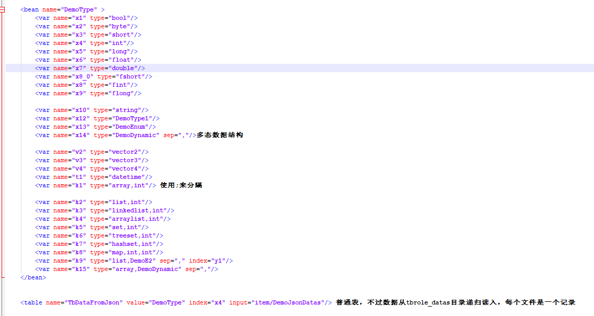

[//]: # (Author: bug)
[//]: # (Date: 2020-11-01 16:26:41)

# Lua 数据

## 

* 与 json 相似定义。  
* 唯一区别在于， lua 的table的key支持任意格式，所以 lua 的map 可以直接  {[key1] = value1, [key2] = value2, ,,,}
*   
* 注意 数据前有一个  return 语句。因为 lua 数据是当作 lua 文件加载的，每个加载后的结果当作一个记录读入。

```xml
<bean name="DemoType2" >
	<var name="x4" type="int" convert="DemoEnum"/>
	<var name="x1" type="bool"/>
	<var name="x5" type="long" convert="DemoEnum"/>
	<var name="x6" type="float"/>
	<var name="x7" type="double"/>
	<var name="x10" type="string"/>
	<var name="x12" type="DemoType1"/>
	<var name="x13" type="DemoEnum"/>
	<var name="x14" type="DemoDynamic" sep=","/>多态数据结构
	<var name="v2" type="vector2"/>
	<var name="v3" type="vector3"/>
	<var name="v4" type="vector4"/>
	<var name="t1" type="datetime"/>
	<var name="k1" type="array,int"/> 使用;来分隔
	<var name="k2" type="list,int"/>
	<var name="k8" type="map,int,int"/>
	<var name="k9" type="list,DemoE2" sep="," index="y1"/>
	<var name="k15" type="array,DemoDynamic" sep=","/> 
</bean>

<table name="TbDataFromLua" value="DemoType2" input="test/lua_datas"/> 
```

递归遍历test/lua_datas整个目录树，**按文件名排序后**依次将每个lua数据当作一个记录读入。其中1.lua文件内容如下


```lua
return 
{
	x1 = false,
	x2 = 2,
	x3 = 128,
	x4 = 1122,
	x5 = 112233445566,
	x6 = 1.3,
	x7 = 1122,
	x10 = "yf",
	x12 = {x1=1},
	x13 = "D",
	x14 = { __type__="DemoD2", x1 = 1, x2=3},
	v2 = {x= 1,y = 2},
	v3 = {x=0.1, y= 0.2,z=0.3},
	v4 = {x=1,y=2,z=3.5,w=4},
	t1 = "1970-01-01 00:00:00",
	k1 = {1,2},
	k2 = {2,3},
	k8 = {[2]=10,[3]=12},
	k9 = {{y1=1,y2=true}, {y1=10,y2=false}},
	k15 = {{ __type__="DemoD2", x1 = 1, x2=3}},
}
```